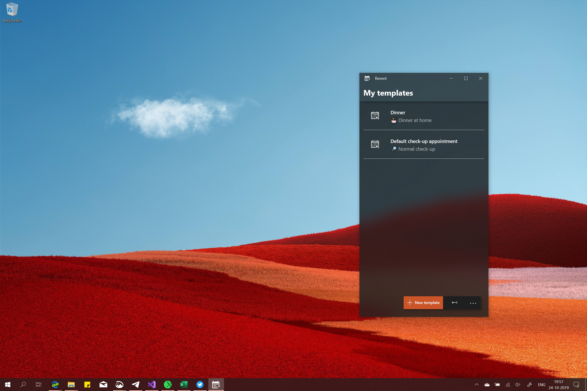
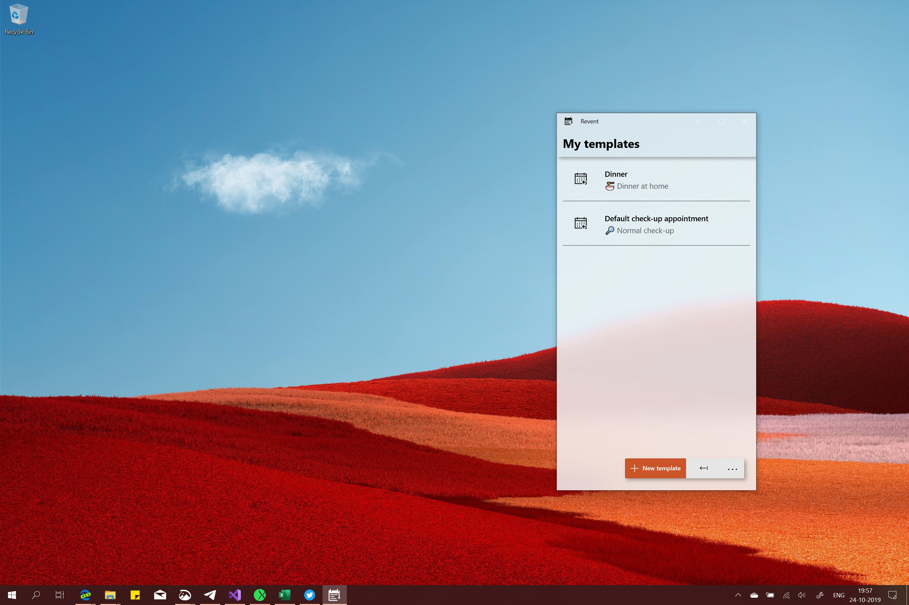

# Revent
A tool to easily create multiple appointments with repeating details. This is a complete rework of the classic UWP-app Revent on the Microsoft Store build on a new codebase to improve reliability and stability.

## Notes
Please keep in mind that this is a complete rework of the classic app. So new core, new code, everything. This to make sure this new version will stand the test of time. :)

## Get the app
**The easy way**: You can purchase the app from the Microsoft Store [here](	https://www.microsoft.com/store/apps/9NBLGGH51FCN). This way you can support my work as well. 

A free trial with no limitations is available there as well, it just shows a banner that you're running the trial version. ;)

**The hard way**: You can build and tinker with the project yourself.

## Supported Windows versions
**Minimal supported Windows 10 version:** 18362 (1903)

**Minimal supported Windows 10 version:** 17763 (1809)

**Currently supported systems:**

* Windows 10 Desktop ✔
* Windows 10 Team ✔
* Windows 10 Holographic ✔
* Windows 10 Mobile ❌
* Windows 10 Xbox ❌

## Screenshots

## Support me
**Like this project?** [Buy me a coffee](https://paypal.me/ikarago)
